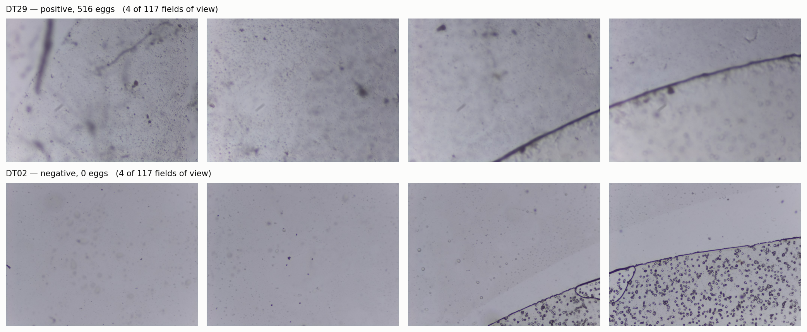
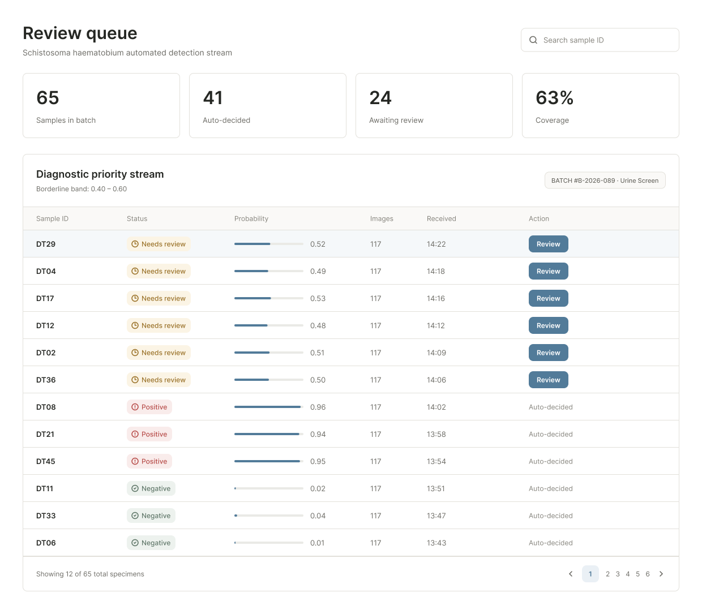
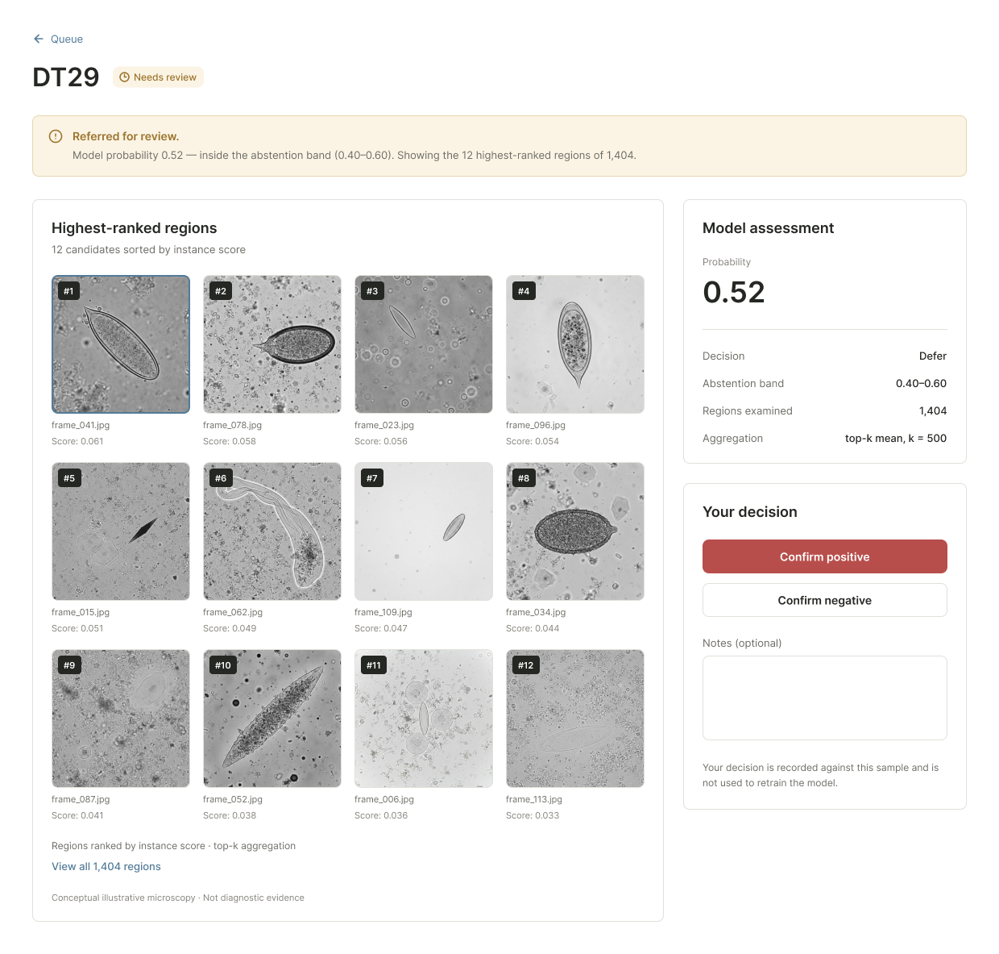
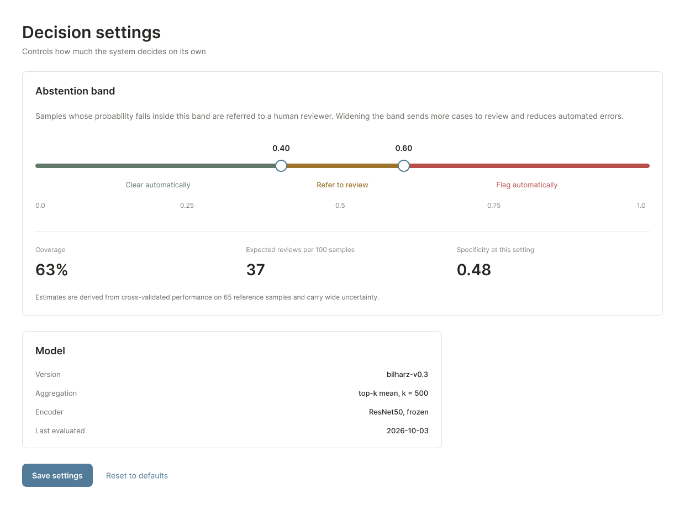
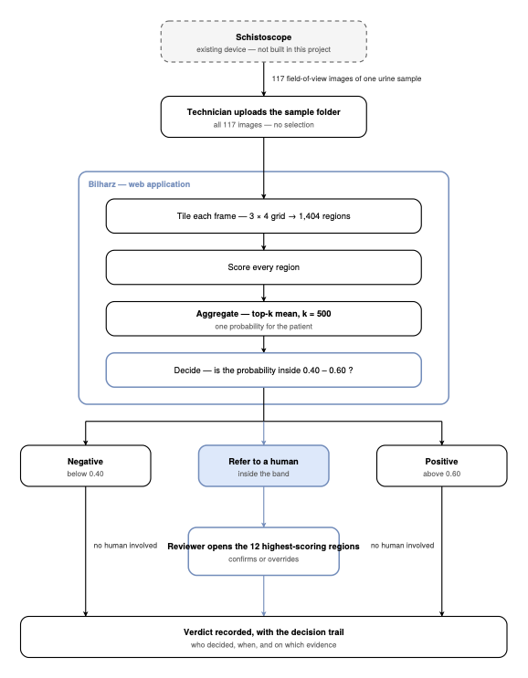
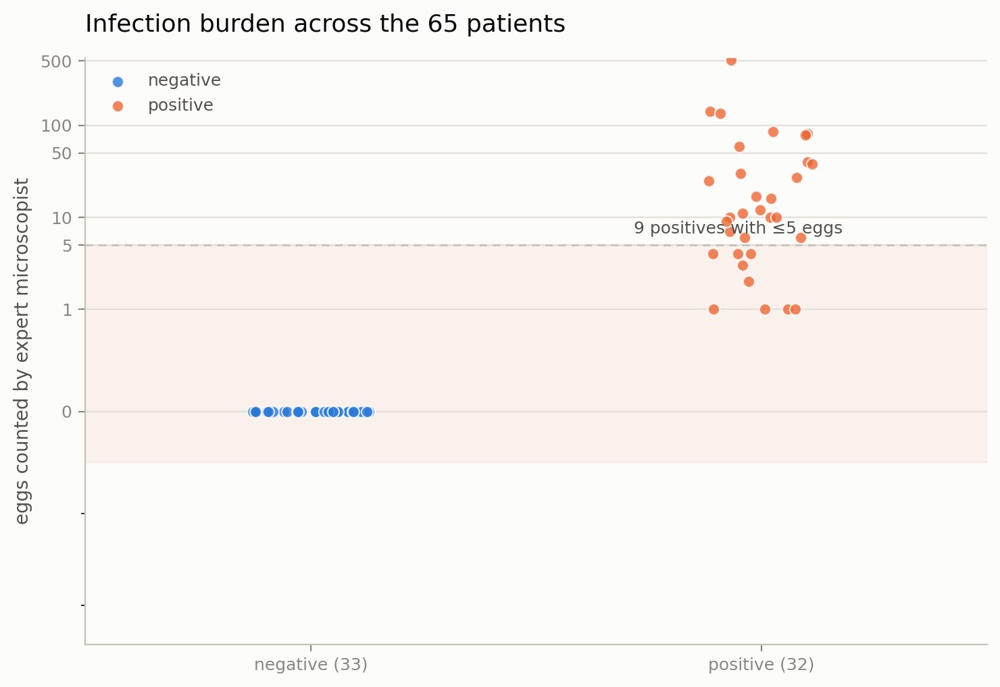
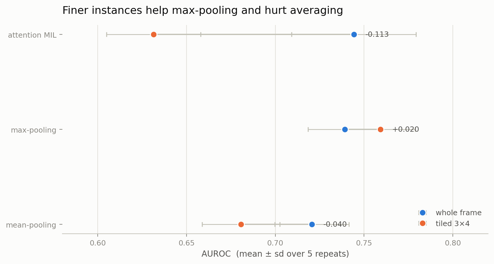

# Bilharz

Patient-level triage for urogenital schistosomiasis, using uncertainty-aware
aggregation and human-in-the-loop deferral.

Final-year capstone · BSc Software Engineering (Machine Learning) ·
African Leadership University · Glory Paul

**Repository:** https://github.com/Glorycodess/bilharz
**Live API:** https://bilharz-api.onrender.com/docs
**Figma mockups:** <paste your Figma share link>
**Video demo:** <paste your video link>

---

## 1. Description

### What schistosomiasis is

Schistosomiasis — bilharzia — is caused by parasitic blood flukes. Freshwater
snails release larvae that penetrate human skin on contact with infested water.
Inside the body the larvae mature into adult worms that live in blood vessels. Some
of their eggs leave in urine or faeces and re-enter the water, continuing the cycle;
the rest lodge in tissue, where the immune reaction to them causes the actual
disease.

**Urogenital schistosomiasis**, caused by *Schistosoma haematobium*, is the form
this project targets. Its classic sign is blood in the urine. Left untreated it
progresses to fibrosis of the bladder and ureters, kidney damage, and in late stages
bladder cancer.

In women it causes **female genital schistosomiasis** — genital lesions, vaginal
bleeding, pain during intercourse, vulval nodules, and ectopic pregnancies. It is a
recognised risk factor for HIV infection, particularly in women. In men it damages
the seminal vesicles and prostate, causes blood in semen and painful ejaculation,
and can lead to infertility.

### Who it affects

Poor rural communities without safe water or sanitation. Farmers, fishermen and
irrigation workers whose work puts them in the water. Women washing clothes in
infested rivers. And above all **school-aged children**, who swim, play and fish in
the same water — carrying chronic infections that cause anaemia, stunted growth and
impaired learning during the years that matter most.

As of 2024, WHO reports:

| | |
|---|---|
| People requiring preventive treatment | **253.7 million** |
| People actually treated | **100.5 million** |
| Proportion of those needing treatment who received it | **39.6%** |
| Proportion of those requiring treatment who live in Africa | **≥ 93.9%** |

Nearly 94% of the global burden sits in Africa, and well under half of those who
need treatment get it.

### Why diagnosis is the bottleneck

Treatment is cheap and effective. The hard part is knowing who to treat. Diagnosis
means finding parasite eggs in urine under a microscope — slow, skilled work, in
places with few trained microscopists.

The **Schistoscope** is an automated microscope built for exactly this. It
photographs each urine sample as **117 field-of-view images** and runs a detector on
every one. The patient-level verdict then uses an **any-detection rule**: if an egg
is detected in any single frame, the patient is called positive.

Meulah et al. (2022), across 487 participants in rural Nigeria, measured what that
costs:

| | Sensitivity | Specificity |
|---|---|---|
| Semi-automated (human reviews flagged images) | 80.1% | **95.3%** |
| Fully automated (any-detection rule) | 87.3% | **48.9%** |

Roughly half of healthy people are told they have a parasitic infection.

That matters in both directions. A missed infection leaves a child carrying a
disease that will scar their bladder and shorten their schooling. A false positive
wastes a dose and, repeated across a community, erodes trust in the screening
programme that the whole control effort depends on.

### What this project does

The failure above is not in detection. It is in **aggregation** — the step that
turns 117 image-level outputs into one patient-level decision — and that step has
not been treated as a modelling problem in this pipeline.

Bilharz builds that step, and adds what the published system lacks: the ability to
**abstain** and refer an uncertain case to a human rather than guess.



*Four of the 117 frames from one heavily infected patient (516 eggs) and one
negative patient. Most frames contain no egg at all, even for the positive sample —
which is why a per-image rule fails at the patient level.*

## 2. Setting up the environment

### Requirements
- Python 3.10+
- A Kaggle account (for the notebooks — they need a GPU and the hosted dataset)
- Git

### Running the API locally

```bash
git clone https://github.com/Glorycodess/bilharz.git
cd bilharz/api
python3 -m venv venv
source venv/bin/activate          # Windows: venv\Scripts\activate
pip install -r requirements.txt
uvicorn app:app --reload
```

Open **http://127.0.0.1:8000/docs**.

Try `DT29` for a referral, `DT12` for a confident positive, `DT02` for a confident
negative.

### Running the notebooks

The notebooks run on Kaggle, not locally — they need a GPU and a 2.5 GB image
dataset hosted there.

1. Upload `notebooks/00_mirror_diagnosis_dataset.ipynb` to Kaggle. Enable
   **Internet**, accelerator **None**. Run it. It downloads the archive from Zenodo,
   verifies its MD5, asserts its structure, and saves the prepared dataset as
   notebook output.
2. Upload `notebooks/01_bags_and_mil.ipynb`. Attach the output of notebook 00 as
   input. Enable **GPU (T4)** and **Internet**. Run it. Roughly 20 minutes.

End to end is about 30 minutes, most of it the 12.5 GB download.

## 3. Designs

Seven screens covering the reviewer workflow. Full-resolution exports are in
`design/`.

| Screen | Purpose |
|---|---|
| Sign in | Authentication; notes that all review actions are logged |
| Review queue | Samples the model decided, and those it referred to a human |
| Sample review | The 12 highest-scoring regions of 1,404, with confirm / override |
| Sample record | Final verdict and full decision trail for audit |
| All samples | Searchable archive, showing which verdicts were model vs human |
| Batch report | Outcome breakdown and review statistics for a completed run |
| Decision settings | The abstention band, with coverage and specificity shown live |





**Navigation.** Four top-level destinations in a persistent left rail — Queue,
Samples, Reports, Settings. A technician lives in Queue; everything else is
reference. The primary path is Queue → Review → Record, and each step carries a back
link to the one before it. Status is never communicated by colour alone: every state
is a pill containing an icon and a word.

**Decision settings** is the screen that carries the project's argument. The
abstention band is a draggable range, and widening it shows coverage falling and
specificity rising in real time — the central trade-off of the system, made
adjustable rather than buried in a config file.

## 4. Deployment plan

**Current.** The API is a FastAPI service with auto-generated OpenAPI docs, deployed
to Render's free tier from this repository. Pushes to `main` redeploy automatically.
It serves stored probabilities rather than running live inference — it demonstrates
the decision path, not production serving.

**Next.** Package the trained model with the service, load weights at startup, and
accept an uploaded sample folder instead of a sample ID. Add a persistent store for
reviewer decisions, which currently live in memory. Containerise so the same image
runs locally, in CI, and in a hospital's own infrastructure — relevant because these
laboratories often cannot send patient data to a third-party cloud.

**Longer term.** The Schistoscope is a field device, often used with intermittent
connectivity. A realistic deployment runs inference on or beside the microscope and
synchronises records when a connection is available, rather than assuming a live
server.



## 5. Video demo

<paste link>

---

## Data

[Schistosoma Haematobium Egg Image Dataset](https://doi.org/10.5281/zenodo.6467268) ·
Zenodo · CC-BY-4.0

- 65 patient samples (DT01–DT65), **exactly 117 images each**, 7,605 total
- 32 positive, 33 negative
- Expert egg counts 0–516; **nine positives have ≤5 eggs**
- Original resolution 2028 × 1520

The archive is verified against its published MD5 before use, and the 65 × 117
structure is asserted rather than assumed. A `manifest.csv` and `provenance.json`
are written alongside the images so the dataset can be reproduced exactly.



Those nine low-burden positives are not an edge case to be tidied away. A light
infection is an early infection — the patient you most want to catch, before the
scarring starts. They are also where a single missed or spurious detection among
1,404 regions flips the verdict.

## Model

A frozen ImageNet ResNet50 encodes each instance; the feature map is average- *and*
max-pooled and concatenated (4096-d). Two representations are compared: whole frame
(117 instances per patient) and a 3 × 4 tiling (1,404 instances).

Aggregation is gated attention MIL (Ilse et al., 2018) against two parameter-free
baselines — mean-pooling and max-pooling — plus a top-k sweep where k = 1 is the
any-detection rule and k = 1404 is mean-pooling.

Validation is repeated stratified 5-fold cross-validation, 5 repeats, 25 fitted
models. **Splits are over patients only**; all instances of a patient move together.
Image-level splitting would let the model recognise a patient rather than the
disease, and is the principal leakage risk in this design.

## Initial performance

Whole-frame representation, mean ± sd over 5 repeats:

| | AUROC | Sens@0.5 | Spec@0.5 | Spec@90%Sens | Sens, low burden |
|---|---|---|---|---|---|
| Attention MIL | 0.744 ± 0.039 | 0.681 | 0.673 | 0.442 | 0.511 |
| Max-pooling | 0.739 ± 0.023 | 0.731 | 0.727 | 0.333 | 0.556 |
| Mean-pooling | 0.721 ± 0.023 | 0.675 | 0.655 | 0.406 | 0.533 |

Tiled representation:

| | AUROC | Sens@0.5 | Spec@0.5 | Spec@90%Sens | Sens, low burden |
|---|---|---|---|---|---|
| Attention MIL | 0.631 ± 0.030 | 0.613 | 0.606 | 0.248 | 0.511 |
| **Max-pooling** | **0.759 ± 0.022** | 0.731 | 0.679 | 0.461 | **0.644** |
| Mean-pooling | 0.681 ± 0.024 | 0.650 | 0.636 | 0.285 | 0.489 |




### Findings

**1. Attention-based MIL does not beat max-pooling at n = 65**, and is substantially
worse on the finer representation (−0.113 AUROC). The cause is measured rather than
assumed: attention concentrates on about 11% of the bag, with the ten
highest-weighted tiles carrying roughly half the total mass — seventy times uniform.
It is not failing to concentrate; it is concentrating confidently on the wrong
instances. With 52 training bags, ~1M parameters and no instance-level supervision,
the parameter-free operator wins because it has nothing to overfit.

**2. The diagnostic signal is extreme-valued, not distributed.** Moving to finer
instances changed AUROC by **+0.020** for max-pooling, **−0.040** for mean-pooling
and **−0.113** for attention. Finer tiles make a single egg occupy a far larger
share of its own instance, which rewards selection and penalises averaging.

**3. Aggregation breadth has a modest, operating-point-dependent effect.** At a 90%
sensitivity target, specificity rises from **0.376 (k = 1)** to **0.479 (k = 500)**.
At an 80% target, k = 1 is best. AUROC is nearly flat across the sweep
(0.714–0.748). The k = 1 rule is also the least stable configuration measured —
spread of 0.091 versus 0.030 at k = 500 — and unpredictable specificity across sites
is itself a deployment failure.

**4. The published specificity collapse is not dramatically reproduced here, and
that is informative.** The collapse requires a detector that is *confident and
wrong*. The instance scorer used here is a linear probe on frozen generic features —
hesitant rather than confident — so the failure mode is muted. **The trained
detector is load-bearing for the central claim, not an optional refinement.**

## API endpoints

| Endpoint | Purpose |
|---|---|
| `GET /samples/{id}/predict` | Score a sample; return a verdict **or a referral** |
| `GET /review/queue` | Samples the model declined to decide |
| `GET /review/{id}/regions` | The regions a reviewer should inspect, ranked |
| `POST /review/{id}/decision` | Record a reviewer's verdict for audit |
| `GET` / `PUT /settings` | Read or change the abstention band |

Reviewer verdicts are stored for audit and are **not** used to retrain the model.

## Repository structure

bilharz/
├── api/ FastAPI service and dependencies
├── notebooks/ Data preparation and modelling
├── figures/ Generated figures
├── design/ Interface mockups
└── README.md


## Limitations

- Oyibo et al.'s reported specificity cannot be reproduced literally without their
  detector; max-pooling and the k = 1 rule stand in for it.
- The encoder is frozen and has never been fine-tuned on microscopy.
- n = 65. All intervals are wide and several comparisons remain inconclusive.
- Tiles do not overlap, so eggs on a tile boundary are split.
- Reviewer behaviour is simulated against the expert microscopist reference
  standard. No human participants are involved.
- The deferral evaluation itself — risk–coverage curves, AURC, calibration, and a
  random-deferral control — is not yet implemented.
- The deployed service uses stored probabilities rather than live inference.
- Interface mockups use conceptual illustrative microscopy, not diagnostic imagery.

## Next

1. Mirror the detector dataset (`SHdataset_12k`, 103 samples, disjoint from these 65)
2. Train the egg detector
3. Repeat the aggregation sweep with detector confidences
4. Build the deferral evaluation

## References

World Health Organization (2025). *Schistosomiasis fact sheet.*
https://www.who.int/news-room/fact-sheets/detail/schistosomiasis

Meulah, B. et al. (2022). *Performance evaluation of the Schistoscope 5.0.*
Parasites & Vectors.

Oyibo, P. et al. (2023). Schistoscope: an automated microscope with artificial
intelligence for detection of *Schistosoma haematobium* eggs. *Micromachines* 13(5), 643.

Ilse, M., Tomczak, J. M., Welling, M. (2018). Attention-based deep multiple instance
learning. *ICML*.

Geifman, Y., El-Yaniv, R. (2017). Selective classification for deep neural networks.
*NeurIPS*.