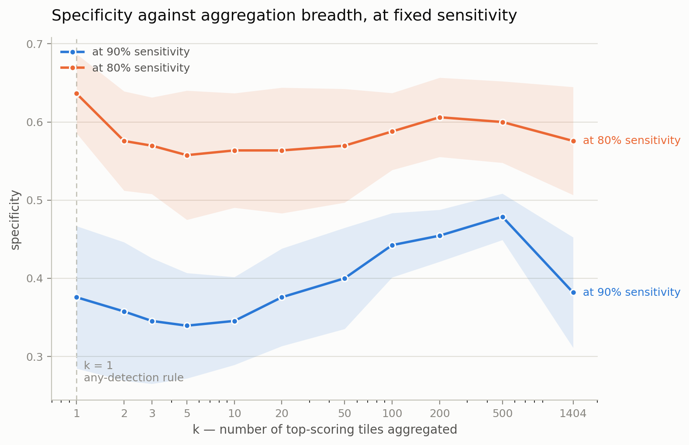

# Bilharz

Patient-level triage for urogenital schistosomiasis, using uncertainty-aware
aggregation and human-in-the-loop deferral.

Final-year capstone · BSc Software Engineering (Machine Learning) ·
African Leadership University · Glory Paul

**Live API:** https://bilharz-api.onrender.com/docs
*(free tier — the first request after a quiet period takes ~30s to wake)*

---

## The problem

The Schistoscope is an automated microscope that screens urine for
*Schistosoma haematobium* eggs. It photographs each sample as **117 field-of-view
images** and runs a detector on every one. The patient-level verdict then uses an
**any-detection rule**: if an egg is detected in any single frame, the patient is
called positive.

Meulah et al. (2022), across 487 participants in rural Nigeria, measured what that
costs:

| | Sensitivity | Specificity |
|---|---|---|
| Semi-automated (human reviews flagged images) | 80.1% | **95.3%** |
| Fully automated (any-detection rule) | 87.3% | **48.9%** |

Roughly half of healthy people are told they have a parasitic infection.

The failure is not in detection. It is in **aggregation** — the step that turns 117
image-level outputs into one patient-level decision — and that step has not been
treated as a modelling problem in this pipeline.

This project builds that step, and adds the thing the published system lacks: the
ability to **abstain** and hand an uncertain case to a human instead of guessing.

## Data

[Schistosoma Haematobium Egg Image Dataset](https://doi.org/10.5281/zenodo.6467268) ·
Zenodo · CC-BY-4.0

- 65 patient samples (DT01–DT65), **exactly 117 images each**, 7,605 total
- 32 positive, 33 negative
- Expert egg counts 0–516; **nine positives have ≤5 eggs** — the subgroup where
  aggregation decides the outcome
- Original resolution 2028 × 1520

The archive is verified against its published MD5 (`76c20a6c…ea4d74`) before use,
and the 65 × 117 structure is asserted rather than assumed. A `manifest.csv` and
`provenance.json` are written alongside the images so the exact dataset can be
reproduced by a third party.

## Method

**Encoding.** A frozen ImageNet ResNet50 encodes each instance. The feature map is
average- *and* max-pooled and concatenated (4096-d): average pooling summarises the
field, max pooling preserves the strongest local response, which is what an egg is.
The encoder is never fine-tuned — a deliberate floor, so that measured performance
is attributable to the aggregation step rather than to a specialised detector.

**Two representations.** Whole frame (117 instances per patient) and a 3 × 4 tiling
(1,404 instances). Tile identity is preserved as `filename#tile_index`, so any score
resolves back to a specific crop.

**Aggregation.** Gated attention MIL (Ilse et al., 2018) against two parameter-free
baselines, mean-pooling and max-pooling, plus a top-k sweep in which k = 1 is the
any-detection rule and k = 1404 is mean-pooling.

**Validation.** Repeated stratified 5-fold cross-validation, 5 repeats, 25 fitted
models. **Splits are over patients only** — all instances of a patient move
together. Image-level splitting would let the model recognise a patient rather than
the disease, and is the principal leakage risk in this design. All results are
reported as mean ± standard deviation across repeats.

## Results

Whole-frame representation (117 instances per bag):

| | AUROC | Sens@0.5 | Spec@0.5 | Spec@90%Sens | Sens, low burden |
|---|---|---|---|---|---|
| Attention MIL | 0.744 ± 0.039 | 0.681 | 0.673 | 0.442 | 0.511 |
| Max-pooling | 0.739 ± 0.023 | 0.731 | 0.727 | 0.333 | 0.556 |
| Mean-pooling | 0.721 ± 0.023 | 0.675 | 0.655 | 0.406 | 0.533 |

Tiled representation (1,404 instances per bag):

| | AUROC | Sens@0.5 | Spec@0.5 | Spec@90%Sens | Sens, low burden |
|---|---|---|---|---|---|
| Attention MIL | 0.631 ± 0.030 | 0.613 | 0.606 | 0.248 | 0.511 |
| **Max-pooling** | **0.759 ± 0.022** | 0.731 | 0.679 | 0.461 | **0.644** |
| Mean-pooling | 0.681 ± 0.024 | 0.650 | 0.636 | 0.285 | 0.489 |



### Findings

**1. Attention-based MIL does not beat max-pooling at n = 65**, and is substantially
worse on the finer representation (−0.113 AUROC). The cause is measured rather than
assumed: attention concentrates on about 11% of the bag, with the ten
highest-weighted tiles carrying roughly half the total mass — seventy times uniform.
It is not failing to concentrate; it is concentrating confidently on the wrong
instances. With 52 training bags, ~1M parameters and no instance-level supervision,
the parameter-free operator wins because it has nothing to overfit.

**2. The diagnostic signal is extreme-valued, not distributed.** Moving to finer
instances changed AUROC by **+0.020** for max-pooling, **−0.040** for mean-pooling
and **−0.113** for attention. Finer tiles make a single egg occupy a far larger share
of its own instance, which rewards selection and penalises averaging.

**3. Aggregation breadth has a modest, operating-point-dependent effect.** At a 90%
sensitivity target, specificity rises from **0.376 (k = 1)** to **0.479 (k = 500)**.
At an 80% target, k = 1 is best. AUROC is nearly flat across the sweep
(0.714–0.748). The k = 1 rule is also the least stable configuration measured —
spread of 0.091 versus 0.030 at k = 500 — and unpredictable specificity across sites
is itself a deployment failure.

**4. The published specificity collapse is not dramatically reproduced here, and
that is informative.** The collapse requires a detector that is *confident and
wrong*. The instance scorer used here is a linear probe on frozen generic features —
hesitant rather than confident — so the failure mode is muted. **The trained detector
is therefore load-bearing for the central claim, not an optional later refinement.**

## Deployment

A FastAPI service exposes the decision path, with interactive documentation at
`/docs`.

**Live:** https://bilharz-api.onrender.com/docs

| Endpoint | Purpose |
|---|---|
| `GET /samples/{id}/predict` | Score a sample; return a verdict **or a deferral** |
| `GET /review/queue` | Samples the model declined to decide |
| `GET /review/{id}/regions` | The regions a reviewer should inspect, ranked |
| `POST /review/{id}/decision` | Record a reviewer's verdict for audit |
| `GET` / `PUT /settings` | Read or change the abstention band |

Reviewer verdicts are stored for audit and are **not** used to retrain the model.

Try `DT29` for a deferral, `DT12` for a confident positive, `DT02` for a confident
negative.

Running it locally:

```bash
cd api
python3 -m venv venv && source venv/bin/activate
pip install -r requirements.txt
uvicorn app:app --reload
# http://127.0.0.1:8000/docs
```

Interface mockups for the reviewer workflow are in `design/`.

## Repository
bilharz/
├── api/ FastAPI service and its dependencies
├── notebooks/ Data preparation and modelling
├── figures/ Generated figures
├── design/ Interface mockups
└── README.md


## Reproducing

| Notebook | Does |
|---|---|
| `00_mirror_diagnosis_dataset.ipynb` | Downloads the archive, verifies its checksum, asserts its structure, writes two resolutions plus manifest and provenance |
| `01_bags_and_mil.ipynb` | Encodes instances, builds bags, runs cross-validation, produces all figures |

Both run on Kaggle with a T4 GPU. End to end is roughly 30 minutes, most of it the
12.5 GB download.

## Limitations

- Oyibo et al.'s reported specificity **cannot be reproduced literally** without
  their detector; max-pooling and the k = 1 rule stand in for it.
- The encoder is frozen and has never been fine-tuned on microscopy.
- n = 65. All intervals are wide and several comparisons remain inconclusive.
- Tiles do not overlap, so eggs falling on a tile boundary are split.
- Reviewer behaviour is **simulated** against the expert microscopist reference
  standard. No human participants are involved, and no inter-rater analysis is
  undertaken.
- The deferral evaluation itself — risk–coverage curves, AURC, calibration, and a
  random-deferral control at matched budget — is **not yet implemented**.
- The deployed service uses stored probabilities rather than live inference; it
  demonstrates the decision path, not production serving.

## Next

1. Mirror the detector dataset (`SHdataset_12k`, 103 samples, disjoint from these 65,
   so patient-level evaluation stays leakage-free)
2. Train the egg detector
3. Repeat the aggregation sweep with detector confidences
4. Build the deferral evaluation

## References

Meulah, B. et al. (2022). *Performance evaluation of the Schistoscope 5.0 for
automated detection and quantification of* Schistosoma haematobium *eggs in urine.*
Parasites & Vectors.

Oyibo, P. et al. (2023). Schistoscope: an automated microscope with artificial
intelligence for detection of *Schistosoma haematobium* eggs. *Micromachines* 13(5),
643.

Ilse, M., Tomczak, J. M., Welling, M. (2018). Attention-based deep multiple instance
learning. *ICML*.

Geifman, Y., El-Yaniv, R. (2017). Selective classification for deep neural networks.
*NeurIPS*.